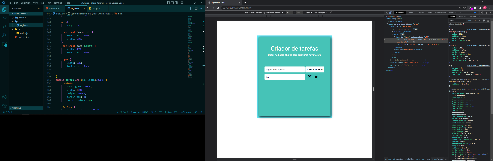

# Estudos para aprendizado de JS

## Criançao de lista de tarefa

> Criação de uma lista de tarefas, para pratica JavaScript, utilização do DOM para criar e adicionar mais elementos, utilização de metados pesquisado pelo documentação.

- [x] Criação do HTML
- [x] Criação do CSS
- [x] Criação do media query
- [x] JavaScript
